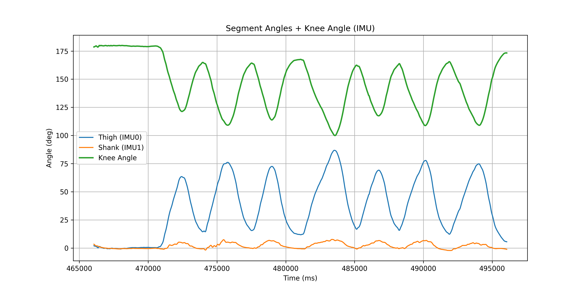
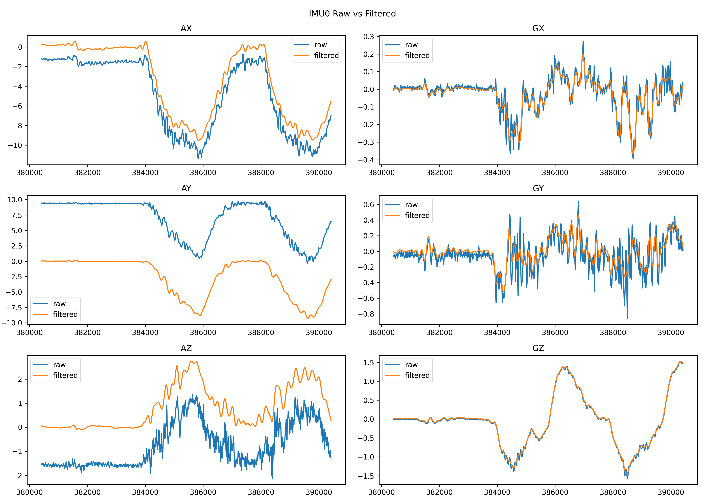
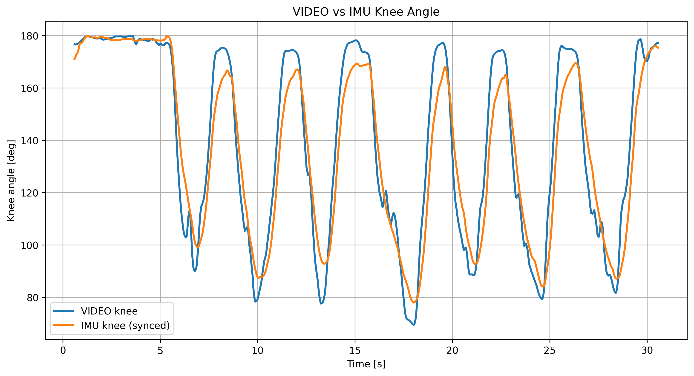

# Human Motion Analysis – Squat Biomechanics System

System for biomechanical analysis of squats using **computer vision and wearable IMU sensors**.

The project estimates **knee joint angle**, detects **squat phases**, and analyzes **movement quality metrics**.

---

# System Architecture

The system combines two sensing modalities:

Video analysis (MediaPipe)  
Wearable IMU sensors (ESP32)

Pipeline:

Video → Pose Estimation → Joint Angles → Squat Detection

IMU → Calibration → Filtering → Orientation → Knee Angle

Video + IMU → Synchronization → Motion Analysis

---

# Hardware

ESP32  
2× IMU sensors (thigh + shank)

IMU data is streamed via UDP to a PC for processing.

---

# IMU Processing Pipeline

RAW IMU data is processed using:

1. sensor calibration  
2. axis alignment detection  
3. low-pass filtering  
4. complementary filter  
5. segment orientation estimation  
6. knee joint angle computation  

---

# Computer Vision Pipeline

Video analysis uses **MediaPipe Pose** to estimate body landmarks.

From landmarks the system computes:

• knee angle  
• hip angle  
• trunk angle  

Angles are smoothed and used for squat phase detection.

---

# Squat Detection

Squats are detected using a finite state machine:

STANDING → DESCENDING → BOTTOM → ASCENDING → STANDING

From detected squats the system extracts:

• descent time  
• ascent time  
• tempo ratio  
• minimum knee angle  
• trunk lean

---

# Example Results

Example plots generated by the system:

- knee joint angle over time
- raw vs filtered IMU data
- synchronized IMU and video signals

---

# Repository Structure

src/
 ├ imu        – IMU signal processing  
 ├ pose       – pose estimation and squat detection  
 ├ io         – plotting, reports, CSV export  

firmware/
 └ esp32_imu_udp – ESP32 code for IMU streaming

---

# How to Run

Video analysis:

[......]

# Example Results

