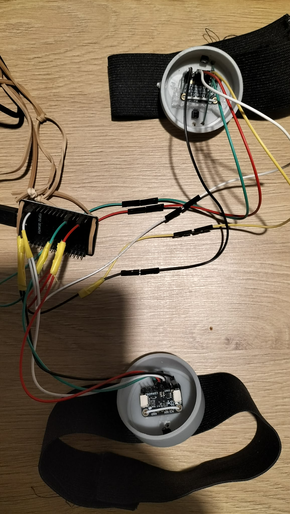
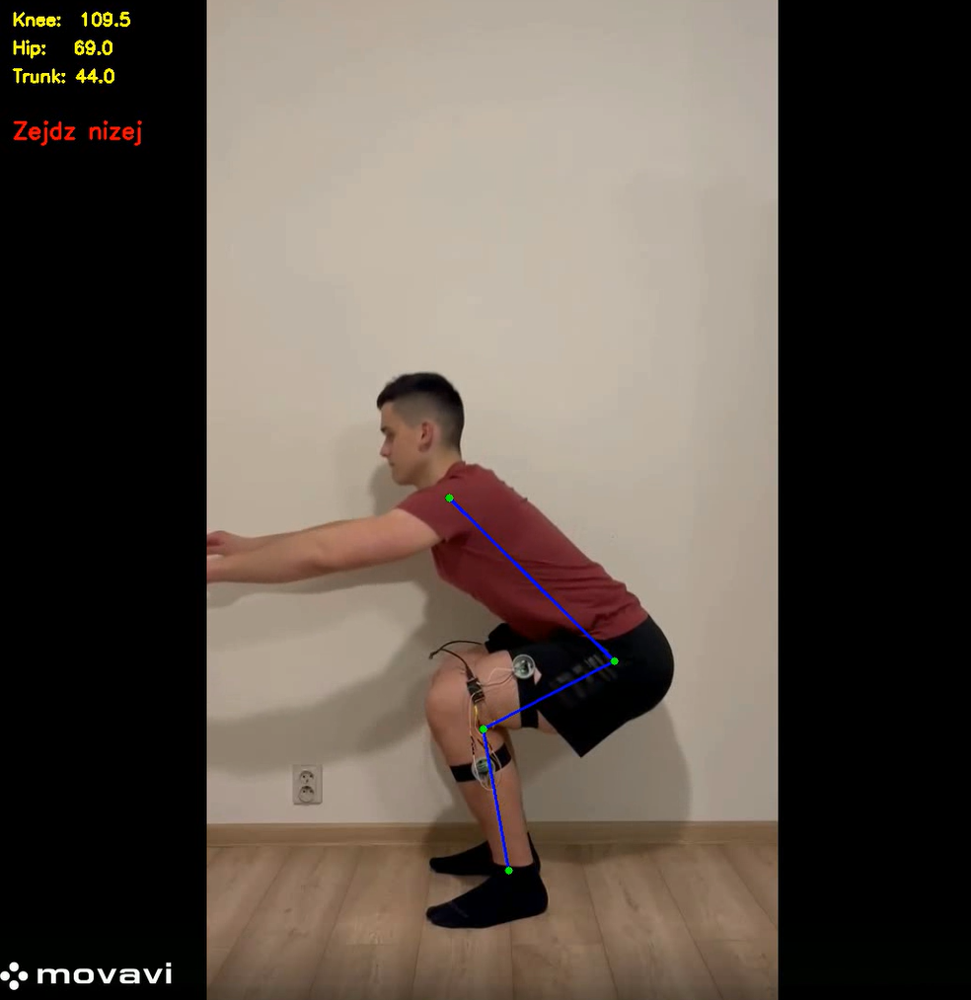

# Human Motion Analysis – Squat Biomechanics System

System for biomechanical analysis of squats using **computer vision and wearable IMU sensors**.

The project estimates **knee joint angle**, detects **squat phases**, and analyzes **movement quality metrics**.

---

# System Architecture

The system combines wearable IMU sensors with computer vision to analyze squat biomechanics.

Pipeline overview:

ESP32 + IMU sensors  
↓  
UDP data streaming  
↓  
Python data receiver  
↓  
Signal processing pipeline  
(calibration, filtering, sensor fusion)  
↓  
Segment orientation estimation  
↓  
Knee angle computation  
↓  
Video analysis using MediaPipe Pose  
↓  
Squat phase detection  
↓  
Synchronization of IMU and video signals  
↓  
Biomechanical metrics and movement quality analysis

---

# Hardware

ESP32  
2× IMU sensors (thigh + shank)

IMU data is streamed via UDP to a PC for processing.

# Hardware Setup

Example hardware setup used during development.

Two IMU sensors are attached to the thigh and shank and stream data to a PC using ESP32 via UDP.

---

# IMU Processing Pipeline

RAW IMU data is processed using:

1. sensor calibration  
2. axis alignment detection  
3. low-pass filtering  
4. complementary filter  
5. segment orientation estimation  
6. knee joint angle computation  

---

# Computer Vision Pipeline

Video analysis uses **MediaPipe Pose** to estimate body landmarks.

From landmarks the system computes:

• knee angle  
• hip angle  
• trunk angle  

Angles are smoothed and used for squat phase detection.

---

# Squat Detection

Squats are detected using a finite state machine:

STANDING → DESCENDING → BOTTOM → ASCENDING → STANDING

From detected squats the system extracts:

• descent time  
• ascent time  
• tempo ratio  
• minimum knee angle  
• trunk lean

---

# Repository Structure

src/
 ├ imu           – IMU signal processing pipeline  
 ├ pose          – pose estimation and squat detection  
 ├ io            – plotting, reports and data export utilities  

firmware/
 └ esp32_imu_udp – ESP32 firmware for IMU UDP streaming

example_data/
 ├ imu_sample.csv
 └ video_frames_sample.csv
     small datasets for demo execution

plots/
 example output plots generated by the analysis

main.py
 video analysis pipeline (MediaPipe + squat detection)

imu_main.py
 IMU processing pipeline

integration.py
 synchronization and combined video + IMU dataset

---
# How to Run

The project contains three main pipelines.

---

## 1. Video Analysis (no hardware required)

python main.py

Performs squat analysis using MediaPipe pose estimation.

Outputs:
- joint angles
- squat phases
- movement quality metrics

---

## 2. IMU Analysis

python imu_main.py

Processes IMU sensor data.

Pipeline:
- calibration
- filtering
- orientation estimation
- knee angle computation
- squat segmentation

Requires IMU CSV dataset.

---

## 3. Video + IMU Dataset

python integration.py

Creates synchronized dataset combining video and IMU signals.

## Quick Demo (No hardware required)

You can run a simplified demo using the example dataset:

python example_main.py

This script loads example data and generates basic plots of the knee angle over time.

Note:
The demo version does **not include full video processing or visualization overlays** (e.g. pose landmarks drawn on video frames).  
Those features require running the full video pipeline with an input video file.

### Demo limitations

The demo mode is intended only to illustrate the data processing pipeline.

It does not include:

• pose landmarks drawn on video frames  
• real-time video visualization  
• IMU sensor streaming  
• full dataset synchronization

These features are available when running the full pipelines.

# Video Analysis Example

Example frame from the video analysis pipeline.

The system detects body landmarks using MediaPipe Pose and computes biomechanical angles in real time.

# Example Results

# Technologies

Programming

• Python  
• C++ (ESP32 firmware)

Libraries

• NumPy  
• Pandas  
• OpenCV  
• MediaPipe  
• Matplotlib  
• SciPy

Hardware

• ESP32  
• IMU sensors

Concepts

• Sensor fusion  
• Complementary filter  
• Signal processing  
• Computer vision  
• Time series analysis  
• Finite state machines

## Author

Patryk Ciechanowski
Automation and Robotics student

GitHub: https://github.com/patryk473